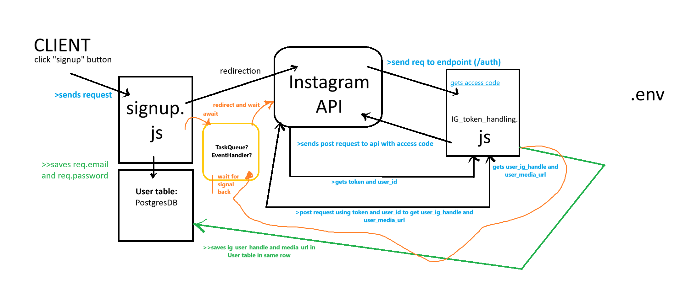

# HonestlyApp

##To run this app:

1.  You need to download the node package manager to set up the environment that runs javascript. How to check if it is already installed?
    Run this on the UBUNTU terminal (if you're using WSL it works too!)

```
node -v
npm -v
```

2. Clone the repository: (using SSH) (Chatgpt this part to know more)

```
git clone git@github.com:yourGithubUsername/HonestlyApp.git
```

3. Change directory to the root folder:

```
cd HonestlyApp
```

4. Open the folder in VS Code by using the following steps: (IMPORTANT: After you change the directory)

```
code .
```

5. Run the server:
   To run the server you need to run the following command:

```
npm start
```

6. Check in on your local browser port 3000 to find the page that has been loaded. (signin signup page)
   It gets loaded from the public folder in the repository called index.html
   (TEAM A: Yib Jared, work on that file before helping out with backend)

7. Create a branch and create that react file mini project
   (Team B) Ibrahim and Blane try looking into this

## Instagram Basic Display API integration:

### How does it integrate:



First Client clicks on the signup button sending request from server.js calling handler from signup.js handler to handle the request.

Signup.js saves the login credentials in a PostgresDB using ORM and then starts an _event handler_ that sends a redirect request to the Instagram API.

-> If unsuccessful, IG API calls a backend endpoint (possibly in Ig_token_handling) that terminates this event handler by throwing an error. <br>
-> If successful, it calls an endpoint in IG_token_handling (/auth) that further communicates with the IG API to get the ig_user_handler and ig_user_media_url.
-> If fail, returns error
-> If successful: It sends a signal to the event handler in Signup to proceed with completing the signup.
-> The data is stored in Usertable and the async Signup functionality ends.

#### To-do:

- Seting up the project in cloud so that the endpoints are actually accessible by IG_Basic_Display_API
- Setting up the project to save files from API to an AWS S3 Bucket (S3 buckets because data (photos) not frequently modified).

#### Things to think about:

Are there any better architural solution to this problem? What if we created a microservice(to handle auth) that scaled with each request to that endpoint?
